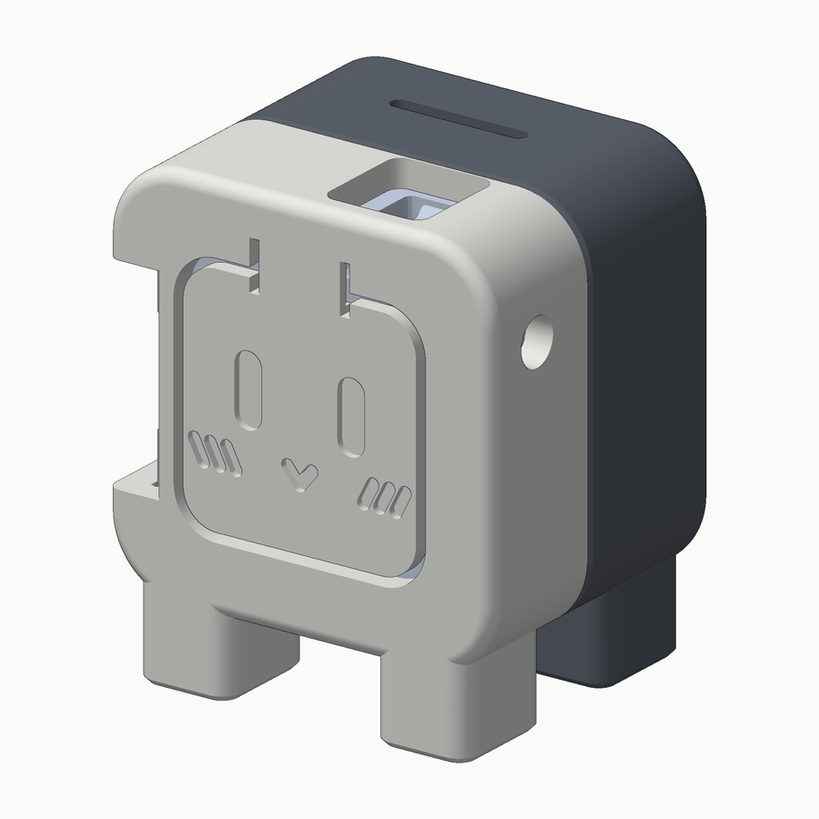
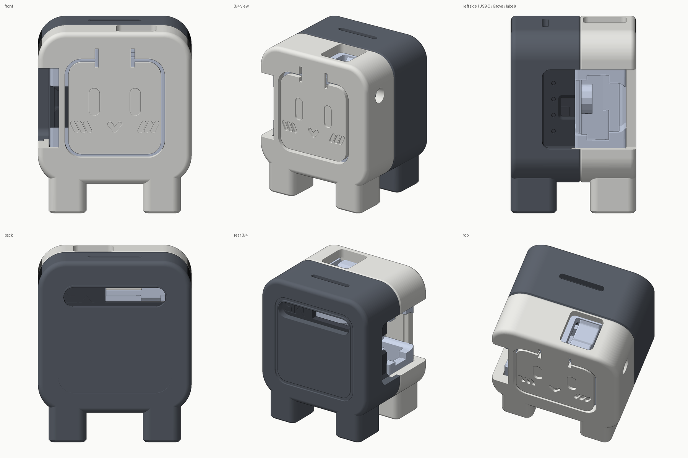
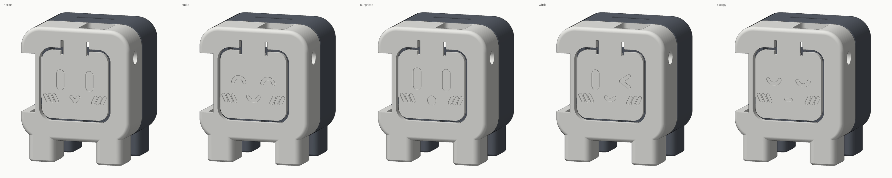
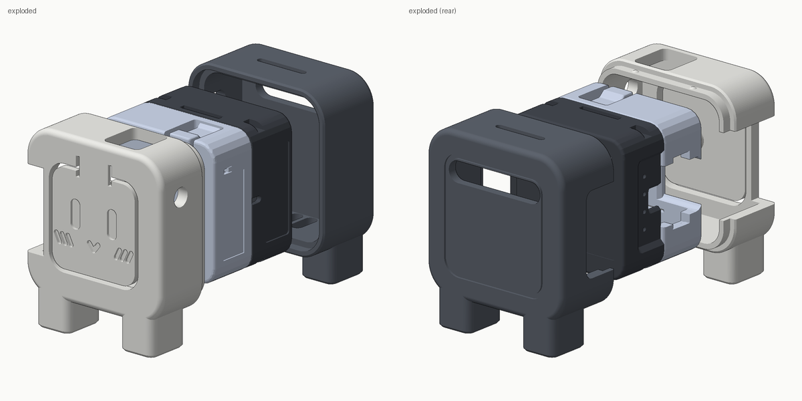

# 一体型フィギュアケース（AtomS3-Lite + Atomic Echo Base）

AtomS3-Lite を Atomic Echo Base に載せた状態のまま収める、脚付きのフィギュア型ケース。
白いフロントシェル（顔と前脚）とグレーのバックシェル（フードと後脚）の 2 部品で構成し、
差し込みとスナップで組み立てる。接着剤もネジも使わない。









> 画像内の水色のパーツは公式 STL から読み込んだ実機形状。STL には基板やコネクタが含まれないため、
> USB-C 部などが空洞に見える。

## ファイル

| ファイル | 内容 |
|---|---|
| `stl/front_shell.stl` | フロントシェル（白、表情「通常」）。印刷向きに回転済み（前面が下） |
| `stl/expressions/front_shell_*.stl` | 表情違いのフロントシェル（`smile` にっこり / `surprised` びっくり / `wink` ウインク / `sleepy` ねむい） |
| `stl/back_shell.stl` | バックシェル（グレー、後脚込み）。印刷向きに回転済み（背面が下） |
| `stl/back_shell_body_only.stl` + `stl/back_feet_only.stl` | マルチカラー印刷用。バックシェルを本体と後脚に分けたもの（下記） |
| `stl/fit_test.stl` | 公差確認用の輪（高さ 4mm）。本番の前に印刷する |
| `step/*.step` | 組立座標系の STEP（Fusion 360 などで編集する場合） |
| `figure_case.py` | パラメトリックモデル本体（CadQuery）。寸法はすべて冒頭の定数 |
| `preview.py` | プレビュー画像の生成と、実機形状（公式 STL）との干渉チェック |

外形は 28.5（幅）× 23.2（奥行き）× 34.0（高さ、脚込み）mm。

## 印刷

- 材料: PLA / PETG
- 向き: STL のまま。フロントは前面を、バックは背面をベッドに付ける。**サポートは不要**
  （フロントの顔がベッド面で平滑に仕上がる）
- 積層 0.12〜0.2mm、壁 3 周以上（側壁は 2.0mm）、インフィル 20% 以上
- 最初の層が潰れる（エレファントフット）と顔パネルの溝や表情の彫り込みが埋まり、嵌合部もきつくなる。
  スライサーの補正を 0.1〜0.2mm 入れる。印刷後、パネルが枠から離れて動くことを確かめる

## 顔パネル（表情とボタン）

前面は顔パネルになっていて、表情を彫り込んである。パネルは上端中央の薄いヒンジだけで枠につながり、
周りを溝で切り離してある。顔を押すとパネルがたわみ、裏の突起が AtomS3-Lite のボタン（前面の
コの字スリットで切られた舌片）を押す。ケースに入れたままボタン操作ができる。

- 表情（目・口・ほほの斜線）は**彫り込み**。前面を下にして印刷するのでサポート不要で、ベッド面の
  平滑な顔になる。コンセプト画の「凸の目」はこの向きではサポートが要るため採っていない
- パネル裏は 0.6mm 逃がしてあり、ボタンに触れるのは押し突起だけ
- 表情は `figure_case.py` の `EXPRESSIONS` に (X, Z) 座標の折れ線と長円で定義してある。追加・変更して再生成すれば
  自分の表情を作れる。`EXPRESSION` が `front_shell.stl` に使う既定の表情

## 組み立て

1. **公差の確認**: `fit_test.stl` を印刷し、デバイス（AtomS3-Lite を装着した Echo Base）を通す。
   すっと入ってガタが小さければよい。きつい・緩い場合は `CLR` を調整して再生成する（下記）
2. AtomS3-Lite を Echo Base に装着したまま、**フロントシェルへ後ろから差し込む**。
   向きはボタン面を前、USB-C を左の窓側、側面のリセットボタン（小タブ）を天面右の切り欠き側にする
3. **バックシェルを後ろから被せ**、継ぎ目がそろうまで押し込む（上下 4 か所のスナップが「カチッ」とはまる）
4. 外すときは、継ぎ目に爪を掛けて前後に引き離す

## 開口部と実機の対応

実機の開口部はすべて公式 STL から位置を割り出して開けてある。スピーカー穴やマイク穴を塞がない。

| 場所 | 開口 | 実機側 |
|---|---|---|
| 正面 | 顔パネル（ヒンジ付き。押すとボタンが押される） | AtomS3-Lite のボタン |
| 左側面 | 前面まで抜けた窓（高さ 15mm） | AtomS3-Lite の USB-C / Grove、Echo Base のラベル凹部と小穴 4 つ |
| 天面右前 | 切り欠き（前面の枠は残す） | AtomS3-Lite のリセットボタン（書き込みモードへの長押しに使う） |
| 右側面 | φ3.4 の丸穴 | AtomS3-Lite の側面の小窓 |
| 背面 | 横長スリット | Echo Base のスピーカー開口 |
| 底面 | スリット 3 本 | Echo Base の通気スリット（脚で浮いているので空気が抜ける） |
| 天面 | 横長スリット | 飾り（コンセプト画のデザイン） |

> Echo Base のスピーカーは背面向きに開口している。音は後ろへ出る。

## 寸法の調整と再生成

`figure_case.py` 冒頭の定数を書き換えて実行すると、`stl/` と `step/` が更新される。

```bash
cd hardware/figure-case
uv run --no-project --with cadquery python figure_case.py
# プレビュー画像と干渉チェック（数分・最大 1.5GB 程度のメモリを使う）
uv run --no-project --with cadquery --with trimesh --with pillow --with rtree python preview.py
```

よく触る定数:

| 定数 | 既定 | 意味 |
|---|---|---|
| `CLR` | 0.25 | デバイスとの片側クリアランス。きつければ 0.3〜0.35 |
| `SNAP` | 0.25 | スナップ突起の高さ。固すぎれば 0.15、緩ければ 0.35 |
| `LAP_CLR` | 0.1 | 前後パーツの嵌合の片側クリアランス |
| `SIDE_WIN_Z` | 7.5 | 左窓の半高。USB-C プラグのモールドが大きいケーブルなら広げる |
| `FOOT_H` / `FOOT_W` | 5.5 / 7.0 | 脚の高さ・幅 |
| `FOOT_TOE` | 0 | 前脚のつま先の張り出し。0 より大きくすると前面を下にした印刷でサポートが要る |
| `HINGE_T` | 0.6 | 顔パネルのヒンジの厚み。押すのが固ければ 0.5、パネルが弱ければ 0.8 |
| `FACE_PRELOAD` | 0 | 押し突起をデバイス前面より奥へ出す量。押しても反応が鈍ければ 0.1〜0.2 |
| `SLOT` | 0.7 | 顔パネル周りの溝幅。1 層目が潰れて溝がふさがる場合は広げる |
| `EXPRESSION` | `normal` | `front_shell.stl` に使う表情 |

## マルチカラー（後脚を白にする）

コンセプト画のように脚をすべて白にしたい場合は、`back_shell_body_only.stl` と `back_feet_only.stl` を
スライサーで 1 つのオブジェクトのパーツとして読み込み、脚に白を割り当てる。両者は同じ座標で出力しており、
重ねると `back_shell.stl` と一致する。単色プリンタなら後脚を塗装してもよい。

## 寸法の出典と注意

- AtomS3-Lite: 24.0 × 24.0 × 9.5mm（[公式 STL](https://github.com/m5stack/M5_Hardware/tree/master/Products/C124_AtomS3-Lite/Structures)）
- Atomic Echo Base: 本体 24.0 × 24.0 × 10.0mm、角 R3。公称の 14.1mm は上面ピン込みの値
  （[製品ページ](https://docs.m5stack.com/en/atom/Atomic%20Echo%20Base)の寸法図）。
  形状は Echo Base を含むキット [K147 AtomS3R AI Chatbot の STL](https://github.com/m5stack/M5_Hardware/tree/master/Products/K147_AtomS3R-AI_Chatbot/Structures) から取り出した
- 公式 STL 上では干渉ゼロを確認済み。ただし**実機での試着はまだしていない**。まず `fit_test.stl` で公差を確かめる
- マイク穴の位置は公開資料に明記がない。候補（左側面の小穴 4 つ、底面スリット）はどちらも開けてある
